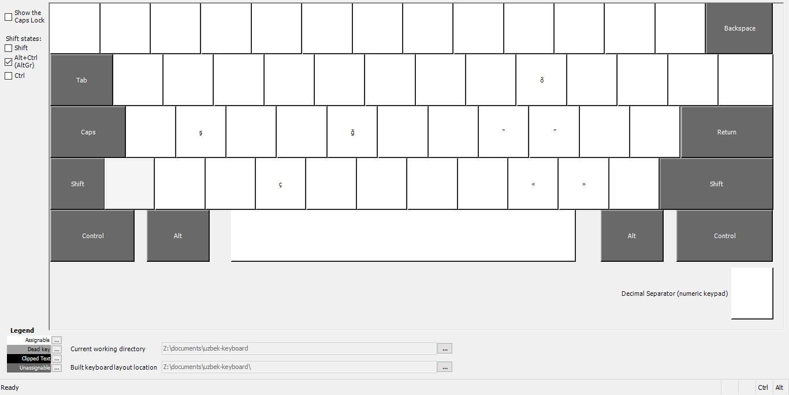
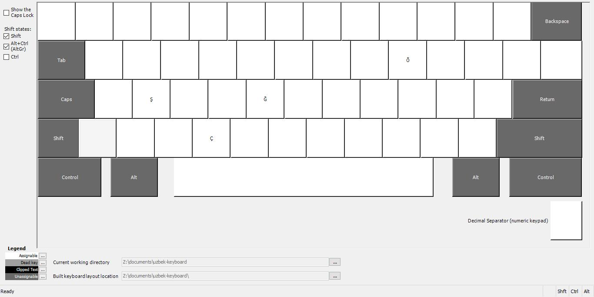

# Uzbek Keyboard Layout for Linux & Windows

A typographically correct keyboard layout for Uzbek, featuring 2023 alphabet updates and quick access to special characters.

## Layouts

This package provides four Linux keyboard layout variants (plus a matching Windows layout, see [Windows](#windows) below):

- **Uzbek (Standard):** The main layout. Base and Shift layers are a plain US QWERTY keyboard — nothing to relearn.
  - `AltGr` gives access to the Uzbek-specific letters **Ş, Ç, Ö, Õ, Ğ, ı** (and `Shift+i` → **İ**).
  - `AltGr` + `` ` `` → **ʼ** (Modifier Apostrophe, U+02BC — the _tutuq belgisi_)
  - `AltGr` + `'` → **ʻ** (Okina, U+02BB — used in _Oʻ/Gʻ_)
  - `AltGr` also gives quick access to typographic extras: em/en dash, **« »** guillemets, curly quotes, superscripts, currency signs, and more.
- **Uzbek (US):** Historically a separate variant; it is now functionally identical to **Uzbek (Standard)** above, kept for naming compatibility.
- **Uzbek (2023):** Based on the proposed 2023 alphabet update, with single-character letters available directly (no `AltGr` needed):
  - `W` → **Ş/ş**
  - `[` → **Õ/õ**
  - `]` → **Ğ/ğ**
- **Uzbek (Cyrillic):** A Cyrillic variant of the Uzbek keyboard layout.


_Detailed view of the **Uzbek (Standard)** layout. Purple keys require `AltGr`, blue keys require `Shift+AltGr`._

## Installation

### NixOS (Recommended)

Add this repository as a flake input to your `flake.nix`:

```nix
# flake.nix
{
  inputs = {
    ...
    # Add this line to your inputs
    uzbek-keyboard.url = "github:itsbilolbek/uzbek-linux-keyboard";
  }

  outputs = {
    ...
    # Add this line to your outputs
    uzbek-keyboard,
  } @ inputs:
  {
    nixosConfigurations."nixos" = nixpkgs.lib.nixosSystem {
      modules = {
        ...
        # Add this line to your modules
        uzbek-keyboard.nixosModules.module
      }
    }
  }
}
```

You can then use the provided layouts by adding them to your `configuration.nix`:

```nix
# configuration.nix
services.xserver.xkb.uz-enhanced.enable = true;
```

### Other Linux Distributions

1. Clone the repository:

```bash
git clone https://github.com/itsbilolbek/uzbek-linux-keyboard.git
cd uzbek-linux-keyboard
```

2. Run the installation script:

```bash
sudo ./install.sh
```

## Windows

A Windows version of the same **Uzbek (Standard)** layout is available, built with the [Microsoft Keyboard Layout Creator](https://www.microsoft.com/en-us/download/details.aspx?id=102134). It mirrors the Linux layout exactly: a plain US QWERTY base, with the Uzbek letters, punctuation, and typographic extras on `AltGr`.

| Base | Shift |
|---|---|
|  |  |

| AltGr | Shift + AltGr |
|---|---|
|  |  |

### Install on Windows

1. Go to the [Releases](https://github.com/itsbilolbek/uzbek-linux-keyboard/releases) page and download the latest `setup.exe`.
2. Run the installer (you may see a Windows SmartScreen warning since the installer isn't signed — this is expected for a small, freely distributed tool; choose **More info → Run anyway**).
3. Open **Settings → Time & Language → Language & Region**, click your language → **Options**, then **Add a keyboard** and choose **Uzbek (AltGr)**.
4. Switch to it using the language indicator in the taskbar, or `Win + Space`.

## Usage

After installation, you may need to **log out and log back in**.

Then, go to your system's **Settings > Keyboard** (or **Input Sources**), search for **"Uzbek"**, and add your desired layout variant.

## License

This project is licensed under the MIT License. See the [LICENSE](LICENSE) file for details.

## Acknowledgements

This project builds on the original Uzbek XKB layout by [itsbilolbek/uzbek-linux-keyboard](https://github.com/itsbilolbek/uzbek-linux-keyboard). Katta rahmat, Bilolbek — asl lotin, 2023, va kirill layoutlarisiz bu loyiha bo'lmasdi!
